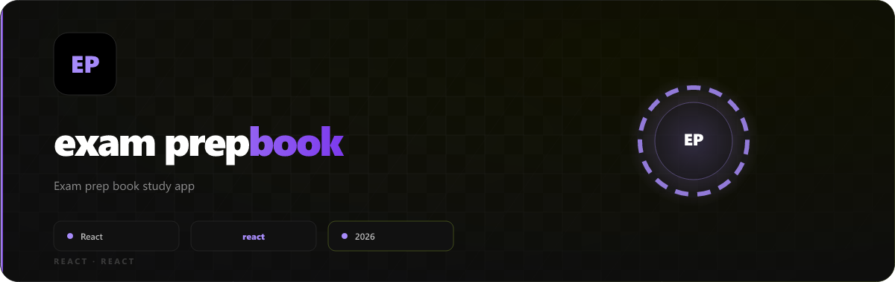
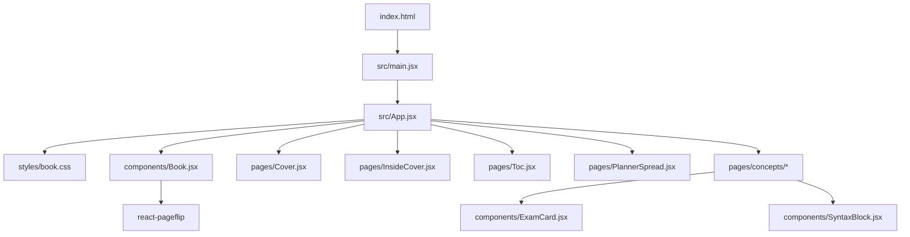

<p align="center">
  
</p>

# 📖 EndSem2Prep — Interactive Semester 2 Study Book

[](https://endsem2prep.vercel.app/)
[](https://react.dev/)
[](https://vite.dev/)
[](https://endsem2prep.vercel.app/)

> **EndSem2Prep** is a gorgeous, fully interactive, 3D page-flipping digital revision book designed to supercharge your end-semester exam preparation. Built with high-fidelity React components and custom animations, it offers a tactile, immersive textbook experience right in your web browser.

✨ **Live Site:** [https://endsem2prep.vercel.app/](https://endsem2prep.vercel.app/)

---

## 🎨 Visual & Tactical Philosophy

Rather than scrolls of dry text, **EndSem2Prep** presents revision material in a realistic **two-page print book layout**. 

* **Left Pages (Intuition):** Focused on core concepts, high-level architectures, logical flows, and analogies.
* **Right Pages (Application):** Packed with live interactive simulations, dry runs, syntax-highlighted code blocks, comparison tables, and active recall exam questions.
* **Rapid-Read Style:** Bolded text highlights critical terms so you can scan the book under 10 minutes before entering the exam hall.

---

## 🚀 Key Interactive Features

* **3D Page Flipping:** Experience realistic page turn physics using click zones, arrow keys, or custom navigational controls powered by `react-pageflip`.
* **Dynamic Study Planners:** An embedded daily schedule tracker mapped hour-by-hour for every subject, countdowns to practical/written exams.
* **Interactive Live Demos:**
  * **DSA Visualization:** Step through the call stack for Recursion, solve the Towers of Hanoi visually, and inspect LIFO/FIFO buffers.
  * **ER-to-Relational Diagrams:** Drag, inspect, and map entity-relationship models to raw SQL tables dynamically.
  * **Interactive Code Blocks:** Powered by `react-syntax-highlighter` to highlight production-ready syntax in Python, SQL, and JavaScript.
* **Active Recall Exam Cards:** Reveal-on-click `details` blocks containing hot, high-probability exam questions and their ideal top-scoring answers.
* **MemoryBox:** Spaced repetition-style memory aid components embedded within concept pages for reinforcing key definitions and formulas.
* **MCQ Quiz System:** Subject-wise multiple-choice quiz mode with per-question scoring, immediate feedback, and a results summary screen.
* **Real-time Leaderboard:** Powered by Convex — quiz scores are persisted to a cloud database and surfaced as a live, deduped top-30 leaderboard per subject.
* **Print-Friendly Export:** A dedicated `/print` route renders all book pages in a clean, ink-optimized layout for PDF export or physical printing.
* **Dark Mode Glassmorphism:** Curated, futuristic neon HSL-tailored color themes for each course, providing a dark visual aura that reduces late-night eye strain.

---

## 📚 Semester 2 Course Syllabus Breakdown

The book is neatly divided into four core colors representing the four main engineering tracks:

### 🔴 1. Data Structures & Algorithms (DSA)
* **Big-O Notation:** Mastering time/space complexity scales, dropping constants, and finding dominant terms.
* **Recursion:** Deconstructing base cases, recursive steps, stack frames, and call stack visualization.
* **Towers of Hanoi:** Explaining the optimal $O(2^n)$ algorithm using an interactive stepper.
* **Stacks & Queues:** Tracking LIFO vs. FIFO behaviors, circular buffers, and solving the Valid Parentheses challenge.
* **Two-Pointer:** Dynamic sliding windows, prefix sums, and index shifting patterns.
* **Trees & BSTs:** Demystifying binary search trees, node lookups, insertions, and heights.
* **Binary Tree Traversals:** Step-by-step guides for Pre-order, In-order, Post-order, and Level-order paths.

### 🔵 2. Application Frontend & Backend Development (AFD)
* **React Core & JSX:** Virtual DOM reconciliation, fiber trees, JSX compilation, and conditional rendering.
* **State vs. Props:** Custom hooks, component lifecycles, and avoiding heavy prop-drilling patterns.
* **useEffect Lifecycle:** Dependency arrays, component mount/unmount triggers, and memory leaks cleanup.
* **State Management & Router:** Context API providers, single-page application routing, and custom hooks.
* **JS Engine Under the Hood:** The execution context, microtask queue, macrotask queue, and the JavaScript Event Loop.
* **Node.js & Express REST APIs:** Creating HTTP web servers, middleware routing, and password hashing using Bcrypt.

### 🟢 3. Foundations of Machine Learning (FOML)
* **Vectorized NumPy:** Dimension arrays, broadcast mechanics, and matrix multiplication.
* **Pandas DataFrames:** Data filtering, sorting, group-by, merging, and handling missing data series.
* **Probability Distributions:** Probability Mass Functions (PMF), Probability Density Functions (PDF), and Normal vs. Binomial distributions.
* **Optimization (Gradient Descent):** Vector derivatives, learning rates, global minima convergence, and loss function reduction.
* **Regression Models:** Mathematical bounds for Linear, Multiple, and Logistic Regression models.
* **Validation & Metrics:** Deconstructing Confusion Matrices, Precision, Recall, F1-Scores, and the Bias-Variance tradeoff curves.

### 🟣 4. Database Management Systems (DBMS)
* **Foundations & ER Models:** Entities, attributes, relationships, PK, FK, composite keys, and relational mapping.
* **Relational Schema & Normalization:** Elimination of redundancies through 1NF, 2NF, 3NF, and Boyce-Codd Normal Form (BCNF).
* **SQL Core & Advanced:** Writing standard DDL/DML, aggregations, inner/outer joins, nested subqueries, and database transactions (ACID properties).
* **MongoDB (NoSQL):** Document collections, JSON/BSON structures, dynamic indexing, sharding strategies, and the Aggregation Pipeline framework (`$match`, `$group`, `$sort`, `$project`).

---

## 🛠️ Technical Stack & Architecture



* **Framework:** React 19 (Functional Hooks, `forwardRef`, `useRef`)
* **Bundler & Tooling:** Vite 8 (Ultra-fast Hot Module Replacement)
* **Interactive Flipping:** `react-pageflip`
* **Syntax Highlighting:** `react-syntax-highlighter` (Prism/Async styles)
* **Style System:** CSS variables, dynamic neon drop-shadows, glassmorphic layout wrappers
* **Analytics:** `@vercel/analytics`

---

## 💻 Local Setup & Development

Bring this interactive book to your local system in just a few steps:

1. **Clone the repository:**
   ```bash
   git clone https://github.com/peterish8/exam-prep-book.git
   cd exam-prep-book
   ```

2. **Install all dependencies:**
   ```bash
   npm install
   ```

3. **Launch the local development server:**
   ```bash
   npm run dev
   ```
   Open your browser and navigate to `http://localhost:5173` (or the port specified in your console).

4. **Build for production deployment:**
   ```bash
   npm run build
   ```
   This generates an optimized output inside the `dist` directory, ready to be hosted on Vercel, Netlify, or GitHub Pages.

---

## ✍️ Authorship & Contributions

* **Creator:** Designed, written, and structured by `~prats` (2026 Semester 2).
* **Feedback:** Contributions to improve clarity, fix concept details, or expand sample exam questions are highly appreciated! Please submit an issue or open a pull request.
<p align="center">
  
</p>
